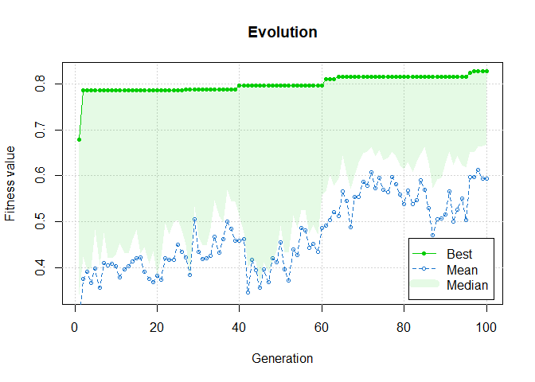

# GAclustenhancer

<!-- badges: start -->

<!-- badges: end -->

The goal of GAclustenhancer is to use genetic algorithms to improve
clustering in situations where clusters are used to calculate
correlation. A GA with a correlation-based fitness function optimizes
clustering results to maximize correlation values. A common use for this
package is with gene expression data analysis. An example using sample
gene expression data is shown below.

This package requires a few imports: GA, methods, Rfast, stats, utils

While not necessary, we suggest you also import DESeq2,
SummarizedExperiment for working with gene datasets.

## Installation

You can install the development version of GAclustenhancer from
[GitHub](https://github.com/frankcsquared/GAclustenhancer) with:

``` r
# install.packages("devtools")
devtools::install_github("frankcsquared/GAclustenhancer")
```

## Example

This is a basic example using pre-loaded data which shows you how to
solve a common problem:

``` r
## load in packages (commented out for markdown)

library(GAclustenhancer)
library(DESeq2)
#> Loading required package: S4Vectors
#> Loading required package: stats4
#> Loading required package: BiocGenerics
#> 
#> Attaching package: 'BiocGenerics'
#> The following objects are masked from 'package:stats':
#> 
#>     IQR, mad, sd, var, xtabs
#> The following objects are masked from 'package:base':
#> 
#>     anyDuplicated, append, as.data.frame, basename, cbind, colnames,
#>     dirname, do.call, duplicated, eval, evalq, Filter, Find, get, grep,
#>     grepl, intersect, is.unsorted, lapply, Map, mapply, match, mget,
#>     order, paste, pmax, pmax.int, pmin, pmin.int, Position, rank,
#>     rbind, Reduce, rownames, sapply, setdiff, sort, table, tapply,
#>     union, unique, unsplit, which.max, which.min
#> 
#> Attaching package: 'S4Vectors'
#> The following objects are masked from 'package:base':
#> 
#>     expand.grid, I, unname
#> Loading required package: IRanges
#> 
#> Attaching package: 'IRanges'
#> The following object is masked from 'package:grDevices':
#> 
#>     windows
#> Loading required package: GenomicRanges
#> Loading required package: GenomeInfoDb
#> Loading required package: SummarizedExperiment
#> Loading required package: MatrixGenerics
#> Loading required package: matrixStats
#> 
#> Attaching package: 'MatrixGenerics'
#> The following objects are masked from 'package:matrixStats':
#> 
#>     colAlls, colAnyNAs, colAnys, colAvgsPerRowSet, colCollapse,
#>     colCounts, colCummaxs, colCummins, colCumprods, colCumsums,
#>     colDiffs, colIQRDiffs, colIQRs, colLogSumExps, colMadDiffs,
#>     colMads, colMaxs, colMeans2, colMedians, colMins, colOrderStats,
#>     colProds, colQuantiles, colRanges, colRanks, colSdDiffs, colSds,
#>     colSums2, colTabulates, colVarDiffs, colVars, colWeightedMads,
#>     colWeightedMeans, colWeightedMedians, colWeightedSds,
#>     colWeightedVars, rowAlls, rowAnyNAs, rowAnys, rowAvgsPerColSet,
#>     rowCollapse, rowCounts, rowCummaxs, rowCummins, rowCumprods,
#>     rowCumsums, rowDiffs, rowIQRDiffs, rowIQRs, rowLogSumExps,
#>     rowMadDiffs, rowMads, rowMaxs, rowMeans2, rowMedians, rowMins,
#>     rowOrderStats, rowProds, rowQuantiles, rowRanges, rowRanks,
#>     rowSdDiffs, rowSds, rowSums2, rowTabulates, rowVarDiffs, rowVars,
#>     rowWeightedMads, rowWeightedMeans, rowWeightedMedians,
#>     rowWeightedSds, rowWeightedVars
#> Loading required package: Biobase
#> Welcome to Bioconductor
#> 
#>     Vignettes contain introductory material; view with
#>     'browseVignettes()'. To cite Bioconductor, see
#>     'citation("Biobase")', and for packages 'citation("pkgname")'.
#> 
#> Attaching package: 'Biobase'
#> The following object is masked from 'package:MatrixGenerics':
#> 
#>     rowMedians
#> The following objects are masked from 'package:matrixStats':
#> 
#>     anyMissing, rowMedians
library(SummarizedExperiment)

## set paths and read in data (change paths before using)
load("./data/count_data.rda") #gene expression count data of dim 882 genes by 348 cell line samples, preprocessed in data-raw/preprocess.R
load("./data/t_count_data.rda") #transposed and preprocessed gene expression count data
load("./data/input_lfc.rda") #L2fc results calculated from DESeq2

## run example on subset of dataset
obj_gene <- ga.clust(dataset = t_count_data[1:100, 1:50], k = 2, plot.internals = TRUE, seed.p = 42, pop.size = ncol(count_data[1:50, 1:100]), known_lfc = input_lfc[1:50])
#>          [,1]    [,2]     [,3]     [,4]      [,5]     [,6]      [,7]     [,8]
#> [1,] 8.916535 8.60031 11.30348 6.071574  9.887405 10.23030 10.367508 5.431245
#> [2,] 9.550063 7.57262 10.69152 5.993728 10.388187 10.27455  9.564877 5.235553
#>          [,9]    [,10]    [,11]    [,12]    [,13]    [,14]    [,15]     [,16]
#> [1,] 8.426131 6.463466 7.299675 5.866786 5.855464 5.624711 7.778474 10.694284
#> [2,] 9.477764 8.051267 9.919529 8.285605 6.019098 6.494040 8.549451  9.245813
#>         [,17]    [,18]    [,19]    [,20]    [,21]     [,22]    [,23]    [,24]
#> [1,] 10.34339 7.668907 11.08274 5.734547 6.046523  9.820387 9.816644 5.605012
#> [2,] 10.89614 5.532766 11.22080 8.523471 7.521220 13.074010 9.636483 4.503515
#>         [,25]    [,26]    [,27]    [,28]    [,29]    [,30]    [,31]     [,32]
#> [1,] 10.36907 6.876785 8.604658 14.32873 11.58426 8.349108 6.429139 10.283470
#> [2,] 12.40792 5.809762 6.326160 13.92562 10.48110 7.416861 6.770693  9.024831
#>         [,33]     [,34]    [,35]    [,36]    [,37]    [,38]    [,39]    [,40]
#> [1,] 7.198064  9.994478 5.643757 3.945392 8.124829 6.329907 4.084431 10.81122
#> [2,] 5.845123 10.546209 6.343818 3.077641 8.079166 7.010235 4.457738 10.00907
#>         [,41]    [,42]    [,43]    [,44]    [,45]     [,46]    [,47]    [,48]
#> [1,] 5.482942 8.601292 5.379924 5.149411 9.071005  9.425534 11.54299 11.11586
#> [2,] 7.602097 9.057270 6.253241 4.445711 8.397700 11.383397 10.70873 11.82147
#>         [,49]    [,50]
#> [1,] 8.886514 7.138866
#> [2,] 6.499837 7.850783
#> 
#>  Description of GA clustering class objects: :
#> 
#> Original data (first rows):
#>                     SCYL3       CFH      ALS2  ZMYND10    POLR2J     DHX33
#> Sample_12-00023  9.652918  7.572394  9.825431 5.922633 10.548802 10.534389
#> Sample_12-00051  9.680046  6.215966 11.025866 5.341967 10.493499  9.054576
#> Sample_12-00066  9.099077  7.864361  9.630823 6.459978 10.677116 10.233018
#> Sample_12-00150  9.543712  8.463599 10.032427 7.577574 10.564352 10.080227
#> Sample_12-00211 10.396564  6.635894 12.774690 6.496269  9.602927 10.855210
#> Sample_12-00258  9.503086 10.273298 10.241464 6.750878 10.403225 10.211902
#>                     ACSM3    COPZ2     CROT   TMEM98 TNFRSF12A     SCIN
#> Sample_12-00023  9.616889 5.659576 8.005183 3.635325  6.926867 4.953818
#> Sample_12-00051 10.740244 4.279519 6.594081 4.855954  9.172873 7.248612
#> Sample_12-00066 11.755667 5.981916 6.853729 4.387993  6.700950 6.361145
#> Sample_12-00150 11.583344 3.951677 7.151289 8.407367  6.492581 5.996658
#> Sample_12-00211 10.872463 5.681298 8.259630 4.422250  6.038573 6.528501
#> Sample_12-00258 10.996405 6.063368 7.939477 5.511489  5.038587 6.353262
#>                    SCN4A     FMO3   ADAM22   PGLYRP1      NFIX   MLXIPL
#> Sample_12-00023 4.242439 4.482643 7.290199 11.130265 12.498471 4.408190
#> Sample_12-00051 6.331484 5.589244 6.717690  5.471206 13.313666 7.895751
#> Sample_12-00066 5.460118 4.852968 8.088020 13.755228  9.445757 4.496723
#> Sample_12-00150 4.652952 4.585880 9.128146  5.996658  9.183269 6.509222
#> Sample_12-00211 5.278335 4.567737 8.512773  6.377333 11.692674 4.697249
#> Sample_12-00258 4.561352 4.279392 6.537398  8.334838  9.524890 7.561820
#>                  RABGAP1      DCN   SEMA3B       LTF   ANGEL1    SNAI2
#> Sample_12-00023 11.67550 4.797440 3.796099 14.408078 10.48428 3.422464
#> Sample_12-00051 12.18189 5.551017 7.954115  9.301981 10.10367 3.715861
#> Sample_12-00066 10.47356 5.305228 5.765108 17.621010 10.49829 3.783437
#> Sample_12-00150 11.80871 5.996658 7.384678  9.708447 10.39459 4.439085
#> Sample_12-00211 11.75911 3.804928 4.814331  8.092891 10.96017 2.899037
#> Sample_12-00258 11.15859 5.471004 4.641893 12.528017 10.10821 2.899037
#>                      FHL1     NLRP2     EHD2     CD44    AGPAT4   ARNTL2
#> Sample_12-00023 10.166827  7.195430 5.093193 15.16915  8.946288 7.616914
#> Sample_12-00051 10.375776 10.313104 9.394387 14.78210  9.577118 9.645072
#> Sample_12-00066  8.555643  5.066174 5.981916 14.85008  8.762000 7.908486
#> Sample_12-00150  9.934858  5.450775 4.834533 14.99880  9.500961 7.912196
#> Sample_12-00211 10.583418  6.038573 9.871402 13.70858 10.932022 8.798670
#> Sample_12-00258  8.077112  4.641893 5.038587 14.66150  9.968467 8.644754
#>                    LRRC7      CTNS      TNC     CAPG      DSG2     ROS1
#> Sample_12-00023 5.630305 10.072881 4.681161 12.80942  8.743979 4.740669
#> Sample_12-00051 7.842666  8.972305 5.952007  9.10371  2.899037 3.480423
#> Sample_12-00066 5.305228  9.535644 6.459978 13.64148  6.459978 2.899037
#> Sample_12-00150 5.519516  8.842004 7.097495 14.73027 10.227343 2.899037
#> Sample_12-00211 5.793047  9.481419 6.635894 11.41345  7.584215 3.427725
#> Sample_12-00258 7.034713 10.117804 4.381436 13.35014  4.855787 4.279392
#>                    PTCD2  ARHGEF5    BCAR1   PIK3CB  CCDC85A  ZNF280C      PKP2
#> Sample_12-00023 8.566410 5.136530 2.899037 11.79074 3.422464 7.308425  4.408190
#> Sample_12-00051 8.172611 7.880783 4.166694 12.18074 2.899037 9.200239  4.642046
#> Sample_12-00066 8.428146 7.205305 3.783437 11.36916 2.899037 7.855371  9.260869
#> Sample_12-00150 8.908948 7.480165 4.889626 11.12294 4.270425 8.573818  7.561790
#> Sample_12-00211 9.636368 8.795384 2.899037 11.40108 4.422250 8.631805  9.652802
#> Sample_12-00258 8.996513 7.021097 2.899037 12.02426 2.899037 7.561820 12.024258
#>                     MSH4     RIOK2      DGKG   FLYWCH1    CCAR1   RIMBP2
#> Sample_12-00023 4.148768  9.700172 10.525671 10.425091 11.76217 5.405805
#> Sample_12-00051 3.893074 10.067804  7.533639 10.306125 12.69224 2.899037
#> Sample_12-00066 4.131613  9.095267 11.210949 11.031231 11.23625 3.974188
#> Sample_12-00150 4.585880 10.084370  8.957945  9.830207 12.37077 3.434039
#> Sample_12-00211 4.868994 10.120162 10.360334 11.350482 11.79616 4.422250
#> Sample_12-00258 7.729972  9.301703 10.909760 11.019625 11.85099 2.899037
#>                  COL11A1
#> Sample_12-00023 2.899037
#> Sample_12-00051 2.899037
#> Sample_12-00066 2.899037
#> Sample_12-00150 3.815518
#> Sample_12-00211 2.899037
#> Sample_12-00258 2.899037
#> 
#> Cluster Centers:
#>      SCYL3     CFH     ALS2  ZMYND10    POLR2J    DHX33     ACSM3    COPZ2
#> 1 8.916535 8.60031 11.30348 6.071574  9.887405 10.23030 10.367508 5.431245
#> 2 9.550063 7.57262 10.69152 5.993728 10.388187 10.27455  9.564877 5.235553
#>       CROT   TMEM98 TNFRSF12A     SCIN    SCN4A     FMO3   ADAM22   PGLYRP1
#> 1 8.426131 6.463466  7.299675 5.866786 5.855464 5.624711 7.778474 10.694284
#> 2 9.477764 8.051267  9.919529 8.285605 6.019098 6.494040 8.549451  9.245813
#>       NFIX   MLXIPL  RABGAP1      DCN   SEMA3B       LTF   ANGEL1    SNAI2
#> 1 10.34339 7.668907 11.08274 5.734547 6.046523  9.820387 9.816644 5.605012
#> 2 10.89614 5.532766 11.22080 8.523471 7.521220 13.074010 9.636483 4.503515
#>       FHL1    NLRP2     EHD2     CD44   AGPAT4   ARNTL2    LRRC7      CTNS
#> 1 10.36907 6.876785 8.604658 14.32873 11.58426 8.349108 6.429139 10.283470
#> 2 12.40792 5.809762 6.326160 13.92562 10.48110 7.416861 6.770693  9.024831
#>        TNC      CAPG     DSG2     ROS1    PTCD2  ARHGEF5    BCAR1   PIK3CB
#> 1 7.198064  9.994478 5.643757 3.945392 8.124829 6.329907 4.084431 10.81122
#> 2 5.845123 10.546209 6.343818 3.077641 8.079166 7.010235 4.457738 10.00907
#>    CCDC85A  ZNF280C     PKP2     MSH4    RIOK2      DGKG  FLYWCH1    CCAR1
#> 1 5.482942 8.601292 5.379924 5.149411 9.071005  9.425534 11.54299 11.11586
#> 2 7.602097 9.057270 6.253241 4.445711 8.397700 11.383397 10.70873 11.82147
#>     RIMBP2  COL11A1
#> 1 8.886514 7.138866
#> 2 6.499837 7.850783
#> 
#> Cluster partitions:
#>   [1] 1 1 2 2 1 1 1 1 1 2 1 1 1 1 2 1 1 2 2 1 1 1 1 2 1 1 1 1 1 1 1 2 1 2 1 1 1
#>  [38] 1 1 1 1 2 2 2 2 1 2 2 1 1 2 2 1 1 1 1 1 1 1 2 2 1 1 1 1 1 1 1 1 1 2 1 1 1
#>  [75] 1 1 2 1 1 1 2 1 1 1 1 1 1 2 2 2 1 1 1 2 1 1 1 2 2 2
#> 
#> log2FoldChange:
#>        SCYL3          CFH         ALS2      ZMYND10       POLR2J        DHX33 
#> -0.068474285 -0.193463149 -0.098307476  0.068208397  0.053943898 -0.007775022 
#>        ACSM3        COPZ2         CROT       TMEM98    TNFRSF12A         SCIN 
#> -0.058411329  0.128153821 -0.024664915  0.227152062  0.096812707 -0.010600617 
#>        SCN4A         FMO3       ADAM22      PGLYRP1         NFIX       MLXIPL 
#> -0.175839683  0.052648221  0.014809169  0.200664667 -0.078279581 -0.074398032 
#>      RABGAP1          DCN       SEMA3B          LTF       ANGEL1        SNAI2 
#> -0.083290574  0.227385702  0.150144253  0.293811664 -0.045157378  0.161822491 
#>         FHL1        NLRP2         EHD2         CD44       AGPAT4       ARNTL2 
#>  0.042421832 -0.183646371 -0.358205495  0.001413391 -0.095997777  0.004912191 
#>        LRRC7         CTNS          TNC         CAPG         DSG2         ROS1 
#>  0.011286826 -0.094732320  0.038977156  0.032153214  0.356921433 -0.107869352 
#>        PTCD2      ARHGEF5        BCAR1       PIK3CB      CCDC85A      ZNF280C 
#> -0.078630435 -0.013879190  0.206694634 -0.036066030  0.244907308 -0.010538035 
#>         PKP2         MSH4        RIOK2         DGKG      FLYWCH1        CCAR1 
#>  0.275596109 -0.056012425  0.012286446  0.009049727 -0.022629772 -0.007656570 
#>       RIMBP2      COL11A1 
#> -0.149810603  0.095572103 
#> 
#> Correlation:
#> [1] 0.8261466
#> 
#> Call:
#> ga.clust(dataset = t_count_data[1:100, 1:50], k = 2, pop.size = ncol(count_data[1:50, 
#>     1:100]), plot.internals = TRUE, known_lfc = input_lfc[1:50], 
#>     seed.p = 42)
```



``` r

## run example on entire dataset (runtime > 1 hour)
#obj_gene <- ga.clust(dataset = t_data, k = 2, plot.internals = TRUE, seed.p = 42, pop.size = ncol(data), known_lfc = input_lfc)
```
